# What Genre Should I Like

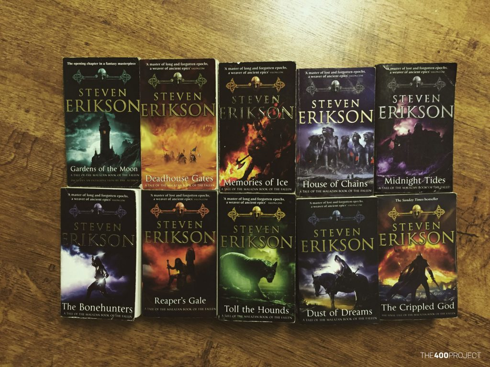
<sup><sup><sup>these books are amazing</sup></sup></sup>

## Table of Contents

- [Project Explanation and Goals](#project-explanation-and-goals)
- [EDA](#eda)
- [Baysian A/B testing](#baysian-ab-testing)
    - [Fantasy and Fiction](#fantasy-and-fiction)
    - [Science-Fiction and Fantasy](#science-fiction-and-fantasy)
    - [Fiction and Vampire](#fiction-and-vampire)
    - [Top 10 tags](#top-10-tags)
- [Linear Models](#linear-models)
- [Future Directions](#future-directions)
- [Acknowledgments](#acknowledgments)

## Project Explanation and Goals

For this project, I decided to look at book genres and the "bleeding" between genres (the enjoyment of one genre given the enjoyment of another genre). The Goodreads 10k book dataset from kaggle seemed perfect because it contained 10 thousand books, user reviews and user given tags. The data sets were made of four CSV files, books, book_tags, ratings, and tags. My end plan is to be able to show an individuals interest in one genre given their interest in any other genre.

## EDA

My first step was to figure out how to put all of the data together so I could search through the data frame. The main problem though is the identifier I am using are the user-generated tags. (tag CSV file) When just loading up these tags, the first thing I noticed was that the majority of the tags are worthless such as to-read, favorite, --31-, and some tags written in Japanese. To deal with this I just did a quick visual search and made a function that removed the most common words I did not care about and would have messed with my analysis.

```python
def dataClean(df):
    for i in ['read', 'book', 'favorite', 'own', 'audio', 'wish-list', '--', 
    'library','buy','kindle','finish','have','audi','borrowed',
    'favourites','default']:
        mask1 = df['tag_name'].str.contains(i)
        df= df[~mask1]
    return df
```

After this, I needed to find out how to group the tags, books, and users so I could select specific genres and mean users reviews. My solution was to join the book_tags, and tag data frames so that I would have tag names tied with book_ids. I then put this data frame through my cleaning function and removed all repeated values so that I would only have one instance of every book and the tag that most people game this book. Then end result looked something like this:

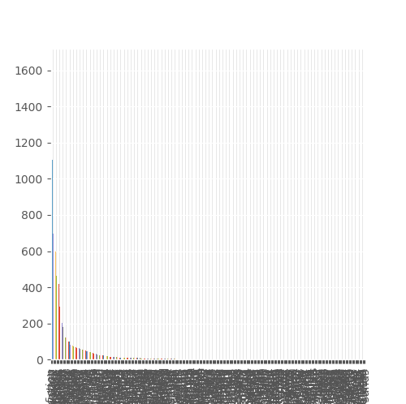

But that is unreadable so here is what the first 50 tags look like:

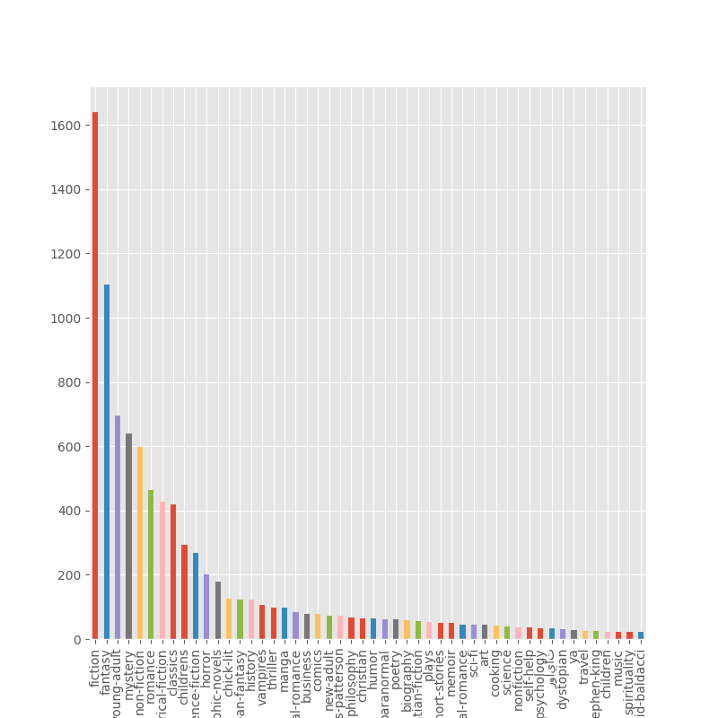
<sub><sub>much better</sub></sub>

I then wanted to look at the distribution of mean user reviews for the main genres I wanted to look at for this project. But my original idea of only considering people who have read more than 4 books in the genre fell apart when I was looking the histograms I was producing and I realized that for some genres the max amount of books read by anyone was just one, so I decided to include everyone who has ever read and rated a book in each genre.

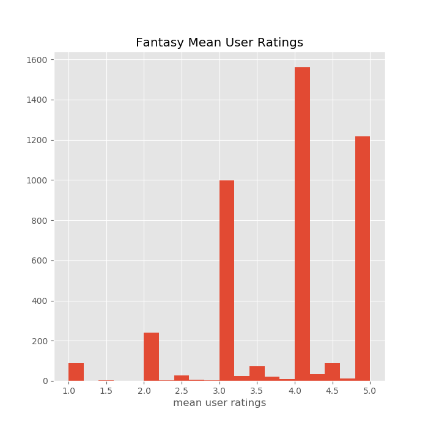 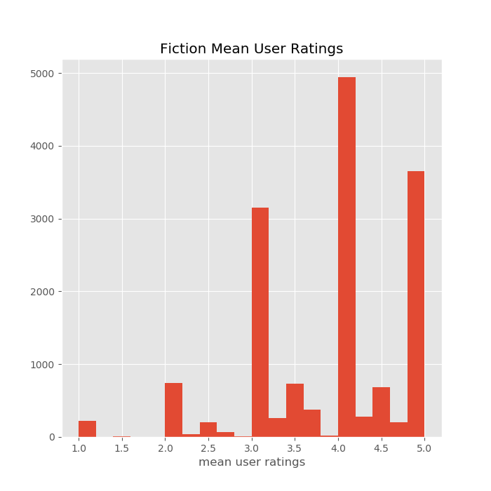
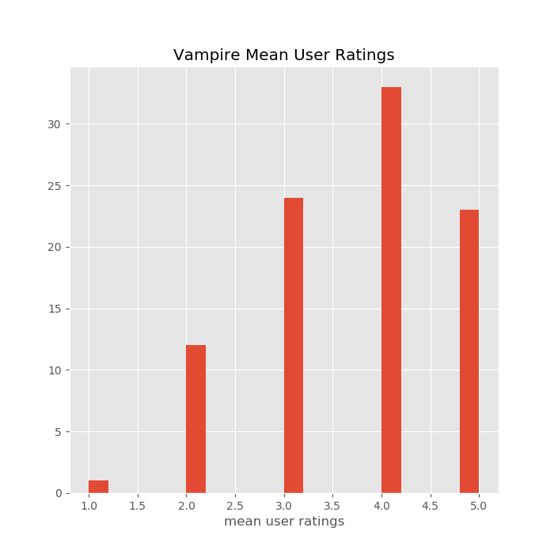 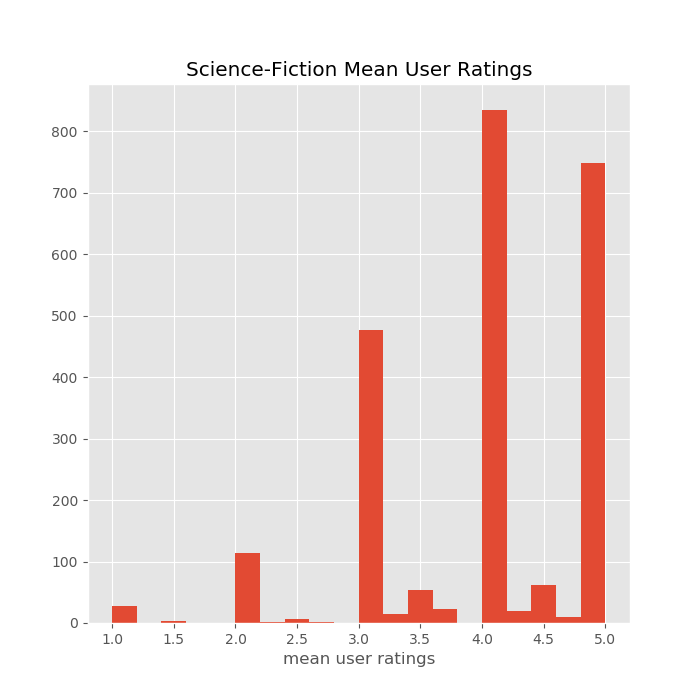

Because I am looking at the mean ratings given by each user you can definitely how many people have only read a single book in each genre especially in the Vampire genre.

## Bayesian A/B testing

After cleaning and organizing my dataset, I decided that the best way to compare genres would be through Bayesian A/B testing because it can show the mean rating that users give to other genres and can give me a numerical value for how much better does one genre reader like another genre. For these experiments, my Null is that individuals give the same rating to the two genres (mean1 = mean2) and my Alt is that they give different values (mean1 != mean2). In order to run these calculations I developed a <a href = https://github.com/Aidan-Jared/What-Genre-Should-I-Like/blob/master/src/BetaDist.py>class</a> to do all the calculation I need to do

### Fantasy and Fiction

The first two genres I compared were fantasy and fiction being the two most common book types. The following is the code that I used to do my calculations for all of the following genres.

```python
df_fantasy = isolate_tag(df_tags_books, 'fantasy', min_books_read)
df_fic = isolate_tag(df_tags_books, 'fiction', min_books_read)
fantasy_fic = Beta.Beta(df_fantasy, df_fic, 'user_rating').compile_analysis('Fantasy', 'Fiction', Plot=True)
plt.show()
print('A/B test, Difference in Mean Rating', fantasy_fic)
'A/B test, Difference in Mean Rating' [0.5153, -0.012692577030812365]
```

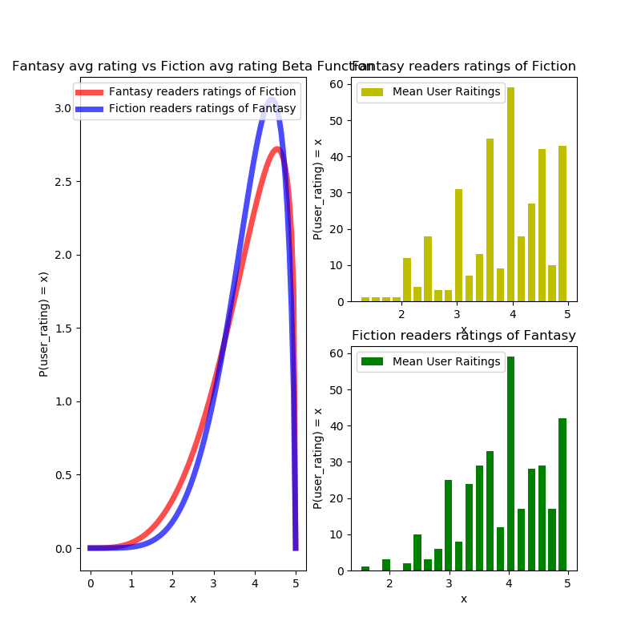

From running the A/B test and the Beta function produced I found that according to the data there is almost almost no difference in the ratings that fans of fantasy give to fiction and vice-versa. The only major differnce between the two plots is that Fantasy reader have a much higer frequency of giving fiction a higher rating to fiction and fiction readers do to fantasy. I ended up getting that model B was better than model A about <b>50%</b> of the time which once again shows no difference between the two models which makes it so I can't reject the null. This does make some sense because these two genres tend to have a lot of overlap in interests and some individuals might consider a fantasy novel to be fiction which would definitely skew the data one way or another.

To double check the distribution of user ratings I took the difference between the average fantasy rating and the average fiction and found that on average, there is only a <b>-.003</b> difference between how individuals rate fantasy and fiction. To me, this shows that if you like fiction or fantasy, you will most likely like the other genre equally as much.

### Science-Fiction and Fantasy

I then compared were Science-Fiction and Fantasy, which I thought would be very close due to the similarity of the genres.

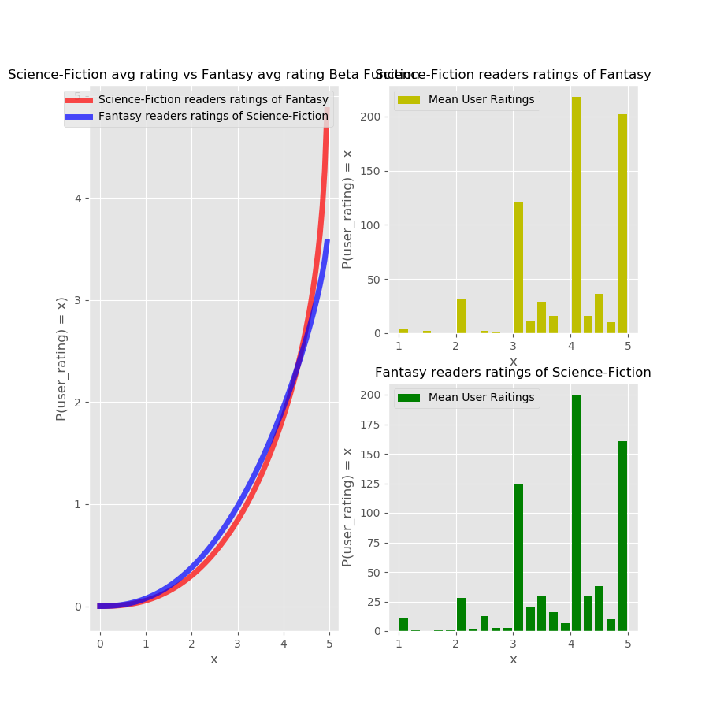

From this figure, it is easy to see that readers of sci-fi and fantasy tend to rate the two genres very high and they are very likely to rate the other genre as a 5 due to the lack of a right tale in either graph. Numerically I found that model B performed better only <b>54%</b> of the time compared to model A and on average there was only a rating difference between the genres of <b>0.13</b>. These elements on top of the visual element show that the Null can't be rejected and individuals tend to rate sci-fi and fantasy the exact same. 

### Fiction and Vampire

After seeing the results for fiction and fantasy, I decided to take a look at the genre called Vampire, which due to the vitriol around twilight and its ripoffs I thought would produce interesting results, and I was right.

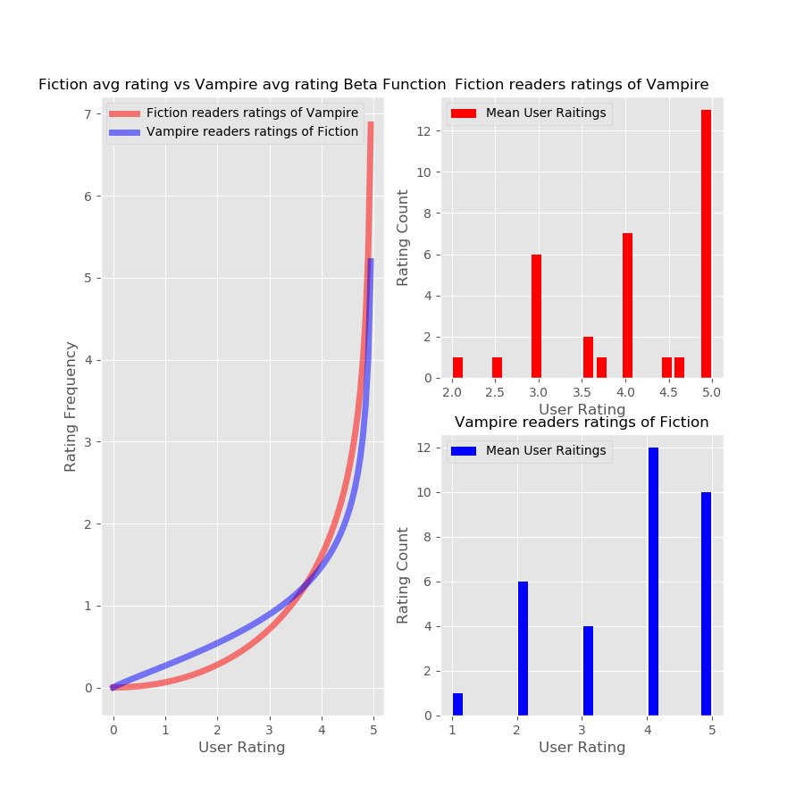

Numeracally, I found that the difference between the two models is only around <b>58%</b> with a rating difference of <b>.37</b> which once again means we cannot reject the Null.

Acording to my EDA, there is not a single person who has read more than a single book in the Vampire genre. I can take this two ways, 1, that people try the vampire genre but never stick around, or 2, that my dataset and data cleaning methods are reducing the total amount of books and people in each genre. For example, let us think of the fictional book, <b>Mary Poppins and the Vampire Apoclypse</b>. How my code works is that it takes a look at the most used tag for each book and makes that the genre of the book, well people who might have read <b>Mary Poppins and the Vampire Apoclypse</b> gave it the tags, fiction, fantasy, vampire, ya, and post-apocalyptic. If fiction was the most used tag my code would result in <b>Mary Poppins and the Vampire Apoclypse</b> becoming part of the fiction genre. When I then try to select people who have read a book in the vampire genre, everyone who has read <b>Mary Poppins and the Vampire Apoclypse</b> will not be considered as a reader for the vampire genre but as readers for fiction. This really shows the weakness of my data and cleaning methods. I believe that if there was a dedicated genre column this process would be much easier, but we should never expect to get the perfect data.

### Top 10 tags

After having this realization, I decided to look at how the ten most used tags compare against each other. In order to accomplish this, I selected the ten most used tags and then ran the resulting list through the combinations tool to produce all the combinations.

```python
def massTagComb(df, num_tag):
        df_user = df[["tag_name"]].sort_values(by=['tag_name'])
        tag_10 = df_user['tag_name'].value_counts().reset_index()
        tag_10 = tag_10.iloc[:num_tag,0]
        tag_comb = combinations(tag_10, 2)
        return tag_comb, tag_10.tolist()
```

I then ran these combinations through my code and resulted in the following values.

|Combinations | Bleed_Over | Avg_Raiting_diff|
| ------------- |:-------------:|:-------------|
|fiction, fantasy|0.4905|1.269258e-02
|fiction, young-adult|0.0000|NaN
|fiction, mystery|0.0000|NaN
|fiction, non-fiction|0.4340|-1.535714e-01
|fiction, romance|0.0000|NaN
|fiction, historical-fiction|0.0000|NaN
|fiction, classics|0.5063|-5.630631e-03
|fiction, childrens|0.0000|NaN
|fiction, science-fiction|0.4861|4.229421e-17
|fantasy, young-adult|0.0000|NaN
|fantasy, mystery|0.0000|NaN
|fantasy, non-fiction|0.5664|3.174603e-03

Because the high amount of NaN and zeros I have to come to the conclusion that while this is a large data set, there are some fundamental flaws in it. First of all the data source is a network for books which is sadly not as popular as movies and video games, this fact then almost self selects the users into being big fans of books already which baizes the results. On top of this, the tag system is user selected which creates a lot of uncertainty about what the genre or categories for each book are. There are probably high-level solutions to this problem such as using multiple nested dictionaries or figuring about a way to categorize the data into genres. At this moment, however, I believe that my code is more of a proof of concept for calculating genre bleed over and with minimal editing could be used on different datasets such as Amazon book sales data.

## Linear Models

After working on the A/B testing, I decided to try to create different Linear models for the data. After considering how to structure the X and y I had the sad realization that 1) the perfect model for all genres would be incredibly computationally intensive with <b>295</b> models and <b>294</b> features each and 2) that with my data cleaning I cannot combine two genres to predicted the third genre due to the sparsity of the data that I am dealing with.
Because of this, I decided to make my linear models proof of concept in order to show what could be done given a better data set. I developed another <a href=https://github.com/Aidan-Jared/What-Genre-Should-I-Like/blob/master/src/linearReg.py>class</a> inorder to quickly access the code to create and test the linear models.

```python
def Ridge_model(df, df1,df2, name):
    X = df['user_rating_x'].values.reshape(-1,1)
    y = df['user_rating_y'].values
    X_train, X_test, y_train, y_test = train_test_split(X, y, test_size=.33, random_state=10)
    LR_R = LR.linearReg(X_train, y_train)
    alpha = [.00001,.0001,.001,.01,.1,1,10,100]
    ridge = LR_R.ridge(alpha,5)
    index = ridge['CVtest_mean_RMSLE'].idxmin()
    a = ridge['lambda'][index]
    pred = Ridge(alpha=a).fit(X_train, y_train).predict(X_test)
    print(LR_R.rmsle(y_test, pred))
    plt.scatter(X_test, y_test)
    plt.plot(X_test, pred)
    plt.ylabel(df2)
    plt.xlabel(df1)
    plt.title('Ridge Regression for {}'.format(name))
    plt.savefig('images/{}_ridge_model'.format(name))
    plt.show()
```

I developed a class that could take in a data frame and make a very simple model and test the model through the k-fold method and then output the RMSLE and lambda values for each model that was tried. Taking this information, my code would find the lowest test error, take the associated lambda values and make the models that you see above.

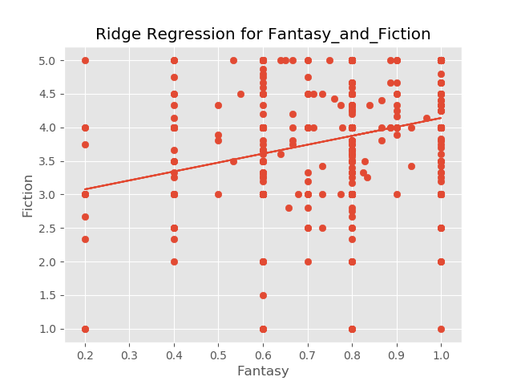

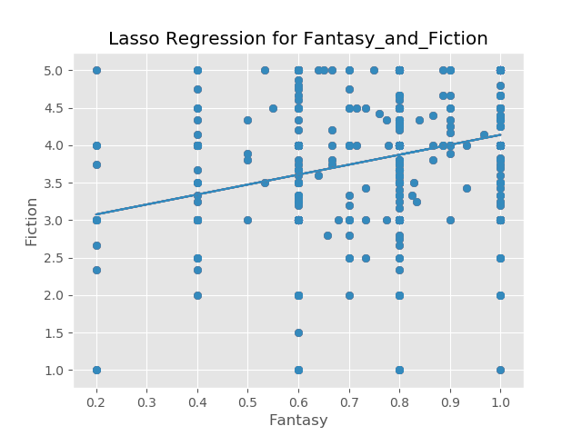

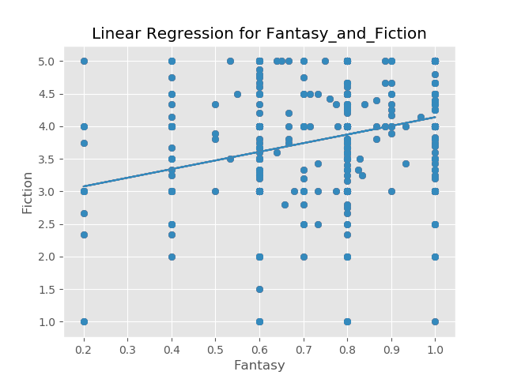

What I found is that because these models only have one feature, the RMLSE produced by Linear Regression, Lasso, and Ridge were all equal at <b>0.1942</b> and the coefficient that all the models produced was <b>1.328</b> and the lambda found for both the Ridge and Lasso was <b>1e-5</b>. This means that in this case all of the models perform just about the same.

## Future Directions

I hope to develop a recommender system that can recommend books in different genres based off of these concepts and maybe even a classifier in order to more accurately segment up to the book population.

## Acknowledgments

- <a href="https://www.kaggle.com/zygmunt/goodbooks-10k#book_tags.csv">Kaggle</a> for the data set
- <a href="https://github.com/Milliemonster/Amazon_reviews_analysis">Millie Smith</a> for the base code to make the Beta Plots
- The Galvanize Instructor Team for help and advice with writing the code
