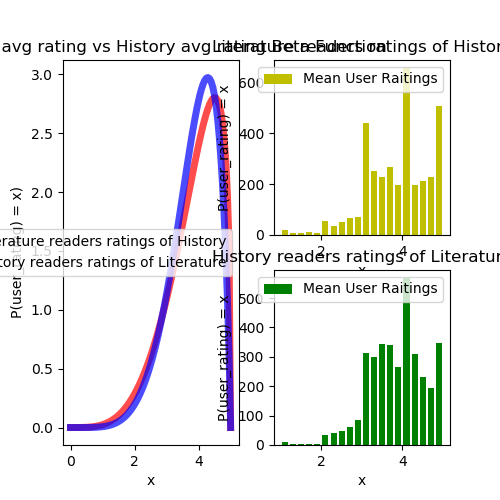
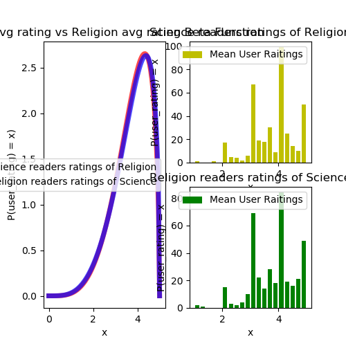

# Galvanize Capstone 1

## Table of Contents

- [Project Explanation and Goals](#project-explanation-and-goals)    
- [Baysian A/B testing](#baysian-ab-testing)        
    - [Fantasy and Literature](#fantasy-and-literature)        
    - [Literature and History](#literature-and-history)        
    - [Science and Religion](#science-and-religion)        
    - [Top 10 tags](#top-10-tags)    
- [Linear Regresion](#linear-regresion)        
    - [Ridge](#ridge)        
    - [Lasso](#lasso)

## Project Explanation and Goals

For this poject I decided to look at book genres and the "bleeding" between genres (the enjoyment of one genre given the enjoyment of another genre). The Goodreads 10k book dataset from kaggle seemed perfect because it countained 10k books, user reviews and user given tags. The data sets was made of four csv files, books, book_tags, ratings, and tags. My end plan is to be able to predict the raitings that someone might give any genre given their enjoyment of one genre. 

My first step was to figure out the structure of the data and how to manipulate it so that I could combine user ID's and tags. Through pandas merge I mangaged to make the dataframe df_rating_tags which was made up of each book_id, the tag_id and name, user_id and the user rating. This data frame became my central dataframe from which I made all other dataframes

## Baysian A/B testing

After cleaning and orginizing my dataset, I decided that the beset way to compare genres would be through Baysian A/B testing because it can show the mean rating that users give to other genres and can give me a numerical values for how much better does one genre fan like another genre.

### Fantasy and Literature
The first two genres I compared were fantasy and literature.

Fantasy tended to only raited literture higher than literature raited fantasy 48% of the time which combined with the graph shows to me that if you are a fan of fantasy or literature you are very likely to enjoy the other genre.

### Literature and History

I then compared were literature and history.

This seems very simular to 51%

### Science and Religion

I then compared were science and religion.

These results suprised me 49%

### Top 10 tags

After having this relisations, I decided to look at how all the top 10 used tags compare against eachother

## Linear Regresion

### Ridge

### Lasso